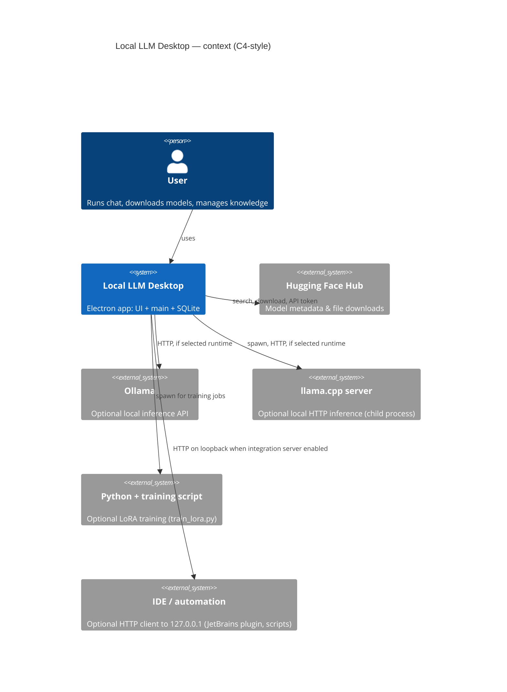

# 3. System Scope and Context

← [Index](./README.md) · Previous: [2. Architecture Constraints](./02-constraints.md)

## 3.1 Business Context

The system is a **desktop client** for local LLM workflows: acquisition (HF), execution (runtime), and augmentation (RAG, training artifacts). It does not host a multi-tenant service; each installation is independent.

## 3.2 Technical Context

## 3.3 System Boundaries

**In scope:** Electron main/preload/renderer, SQLite schema and services, HF client usage, runtime adapters, packaging.

**Out of scope:** Hosting Ollama or llama.cpp binaries inside the repo (detection/paths are configurable); full ML training stack (only orchestration + script path); shipping a production-ready JetBrains Marketplace plugin (a **sample** plugin lives under `integrations/intellij-plugin/`).

→ Next: [4. Solution Strategy](./04-solution-strategy.md)
