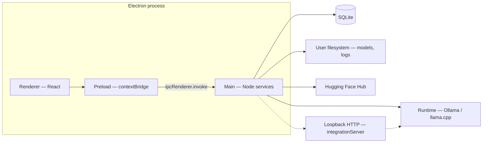

# 5. Building Block View

← [Index](./README.md) · Previous: [4. Solution Strategy](./04-solution-strategy.md)

## 5.1 Level 1 — Containers (logical)

## 5.2 Level 2 — Main process modules (indicative)

| Block | Responsibility |
|-------|----------------|
| `index.ts` | App lifecycle, window, store, DB open, IPC registration, HF token load. |
| `ipc/registerIpc.ts` | Channel handlers; Zod schemas; orchestration of services. |
| `services/hfService.ts` | HF search, model detail, recommendations. |
| `services/downloadManager.ts` | Resumable downloads, registry, cancel, cache coordination. |
| `services/runtime/*` | `createRuntime`, `llamaCppAdapter`, `ollamaAdapter`. |
| `services/chatService.ts` | Conversations/messages CRUD. |
| `services/kbService.ts` | Ingestion, chunking, FTS search, wiki topics/pages. |
| `services/metricsService.ts` | Snapshots and history persistence. |
| `services/trainOrchestrator.ts` | Python process for `train_lora.py`, job status. |
| `services/hardwareSummary.ts` / `gpuProbe.ts` | Hardware introspection for UI. |
| `services/dataMaintenance.ts` | Cache/model wipe, factory reset helpers. |
| `services/integrationServer.ts` | Optional **127.0.0.1** HTTP bridge (`/health`, `/v1/runtime/status`, `/v1/chat`); reads `chatMaxTokens` and integration settings from store. |
| `db/*` | `openDatabase`, `migrate` (versioned SQL). |
| `logger.ts` | Structured log lines to user data `logs/`. |

## 5.3 Level 3 — Key data entities (SQLite)

- **Chat:** `conversations`, `messages` (optional `prompt_tokens`, `completion_tokens`, estimate flags per §5 migrations)
- **HF:** `hf_model_cache`, `downloads`
- **Knowledge:** `kb_sources`, `kb_chunks`, virtual `kb_chunks_fts`, `wiki_pages`, `wiki_page_chunks`
- **Ops:** `metrics_samples`, `train_jobs`

→ Next: [6. Runtime View](./06-runtime-view.md)
