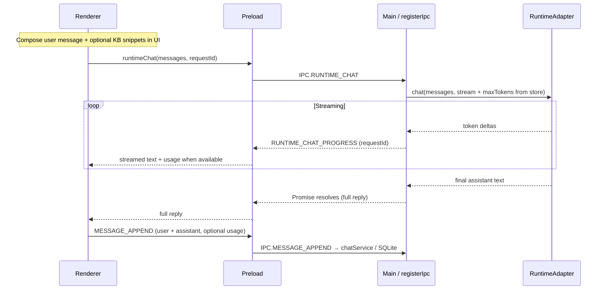

# 6. Runtime View

← [Index](./README.md) · Previous: [5. Building Block View](./05-building-block-view.md)

## 6.1 Typical chat with optional RAG (simplified)

*Notes:*

- **RAG context** is composed in the **renderer** (snippets appended to the outgoing user turn) before `runtimeChat`; main does not call `kbService` inside `RUNTIME_CHAT` today.
- **Max completion tokens** (`chatMaxTokens` in electron-store) are applied in **main** for both the UI path and the **integration server** path.
- **All model I/O** still goes through **main** (`RuntimeAdapter`), not the renderer.

## 6.2 Download flow (HF)

User triggers download → main validates paths → download manager streams from HF (using token from memory/store) → progress via `HF_DOWNLOAD_STATUS` → registry row updated in `downloads`.

## 6.3 Training flow

User starts job → main resolves `train_lora.py` (dev: `training/`; prod: `process.resourcesPath/training/`) → spawns Python with arguments → job row in `train_jobs` updated; status polled via IPC.

## 6.4 IDE / tool integration (optional)

When **integrationListenEnabled** is true, **`integrationServer`** serves **127.0.0.1** only. External clients `POST /v1/chat` with the same `ChatMessage[]` shape; main forwards to `RuntimeAdapter.chat` (non-streaming response). See [intellij-integration.md](../intellij-integration.md).

→ Next: [7. Deployment View](./07-deployment-view.md)
