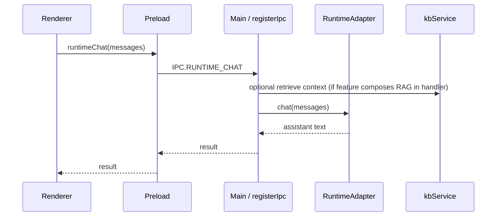

# 6. Runtime View

← [Index](./README.md) · Previous: [5. Building Block View](./05-building-block-view.md)

## 6.1 Typical chat with optional RAG (simplified)

*Note:* Exact RAG injection is implemented in the main handler path that builds the message list before calling the runtime; the important runtime constraint is that **all model I/O goes through main**, not the renderer.

## 6.2 Download flow (HF)

User triggers download → main validates paths → download manager streams from HF (using token from memory/store) → progress via `HF_DOWNLOAD_STATUS` → registry row updated in `downloads`.

## 6.3 Training flow

User starts job → main resolves `train_lora.py` (dev: `training/`; prod: `process.resourcesPath/training/`) → spawns Python with arguments → job row in `train_jobs` updated; status polled via IPC.

→ Next: [7. Deployment View](./07-deployment-view.md)
